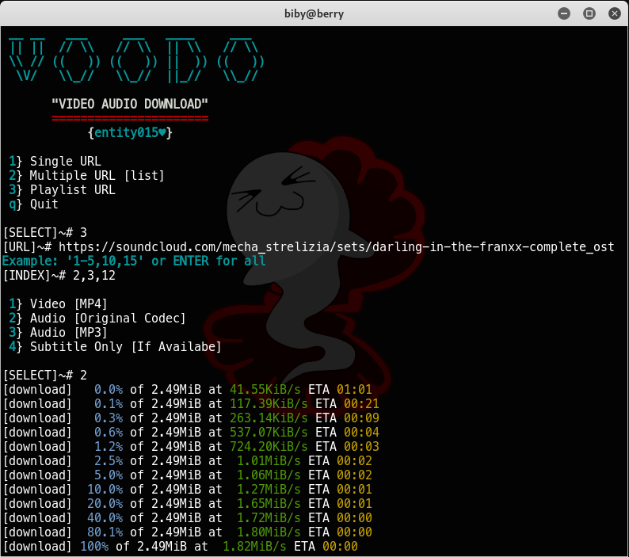

VOODO
=====

Video / Audio Download Based on [**`YT-DLP`**](https://github.com/yt-dlp/yt-dlp).
See [***supported 1500+ sites***](https://github.com/yt-dlp/yt-dlp/blob/master/supportedsites.md).

### Features
- Download single, multiple (list), or playlist (selectable)
- Custom resolution `default: highest`
- Embed subtitle if available `default: en`

### Installation
```bash
apt install python3 expect
python3 -m pip install -U yt-dlp

git clone https://github.com/entity015/voodo

cd voodo
chmod +x voodo
./voodo
```

### Screenshot
*\*example using scloud playlist*



-----